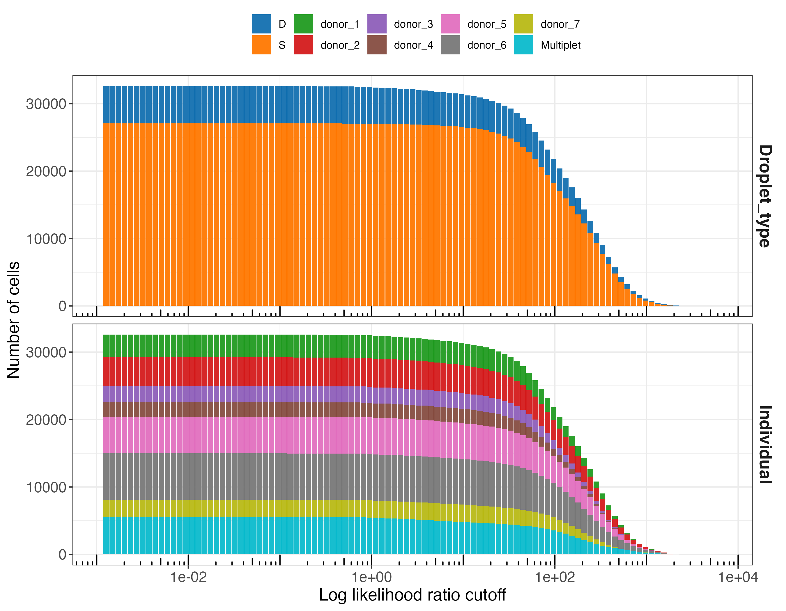
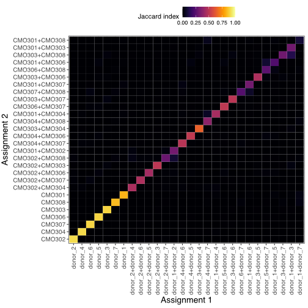

<p>

</p>

Tools for demultiplexing and keeping the riffraff out of pooled single cell sequencing data sets. 

|I want to...|I have...|Tool to use|
|------------|---------|-----------|
|Demultiplex cells by **species** before mapping to a reference genome|A transcriptome (FASTA) or annotation (GTF) and genome (FASTA) per species|[`demux_species`](#demux_species)|
|Demultiplex cells by **individual of origin**, and I hope individuals are unrelated enough to have different mitochondrial haplotypes|A BAM file of aligned scATAC-seq or whole cell scRNA-seq data|[`demux_mt`](#demux_mt)|
|Demultiplex cells by **individual of origin**|VCF of known variants, plus a BAM file of aligned single cell sequencing data|[`demux_vcf`](#demux_vcf)|
|Demultiplex individuals by **custom label** or **treatment**|FASTQs containing MULTIseq/HTO/CITE-seq data, or a table of pre-computed counts|[`demux_tags`](#demux_tags)|
|Assign **sgRNAs** to cells|FASTQs containing sgRNA capture data, or a table or pre-computed counts in [MEX format](https://kb.10xgenomics.com/hc/en-us/articles/115000794686-How-is-the-MEX-format-used-for-the-gene-barcode-matrices)|[`demux_tags`](#demux_tags)|
|Quantify **ambient RNA** per cell and infer its origins|Output from `demux_vcf`|[`quant_contam`](#quant_contam)|
|Infer global **doublet rate**|Output from one or more `CellBouncer` programs run on the same cells|[`doublet_dragon`](#doublet_dragon)|

# Installation
The non-plotting programs in `cellbouncer` require only [HTSLib](https://github.com/samtools/htslib) and [zlib](https://www.zlib.net/). You can install these dependencies yourself, or to make it easier, get these and plotting-related dependencies by creating a [conda](https://github.com/conda-forge/miniforge/releases) environment from one of the included `cellbouncer.yml` files. If you have [mamba](https://anaconda.org/conda-forge/mamba) installed, we recommend using `mamba` in place of `conda` in the `env create` command below, because it will be faster.

The file `cellbouncer_minimum.yml` contains all dependencies you need to run `cellbouncer` programs and make plots. The file `cellbouncer_extra.yml` also includes other programs useful for processing/analyzing data outside of `cellbouncer` that are mentioned in these help pages. The file `cellbouncer_extra_osx.yml` is a version of `cellbouncer_extra.yml` that omits the program [`FastK`](https://github.com/thegenemyers/FASTK), which is not available through `conda` for Mac OSX. If you want to use that program on a Mac, you will need to install it through other means.

To install, first, clone this github repository and its submodules. Then, choose which of the two environment files to use and create a `conda` environment. Then all that's left to do is `make`:

```
git clone --recurse-submodules https://github.com/nkschaefer/cellbouncer.git
cd cellbouncer
[conda/mamba] env create --file=[environment].yml
conda activate cellbouncer
make
```
You've now got all the programs compiled, and you can run them as long as you remember to `conda activate cellbouncer` first.

# Overview
The programs in `cellbouncer` are standalone command line tools. If you run one of them with no arguments or with `-h`, it will give you detailed information about how to run it. Each program uses the concept of an `--output_prefix/-o`, which is a base name that will be used for all output files.

## Output files
Demultiplexing tools all write a file called `[output_prefix].assignments`, which tells you information about each cell's identity. These files are 4 columns, tab separated: 
* cell barcode (optionally with unique ID appended; see below)
* most likely identity (doublets are two names in alphabetical order separated by `+`)
* droplet type: `S` (for singlet), `D` (for doublet), or in some cases `M` (for multiplet, 3+ individuals, so far only considered by `demux_tags`)
* ratio of the log likelihood of the best to the second best assignment (a measure of confidence in the assignment)

### Cell barcode format
In output files, cell barcodes will by default be printed without any additional text (they will consist only of DNA sequences). When there are multiple data sets to be analyzed together, additional text must be appended to barcodes from each data set to prevent barcode collisions. Different programs have different conventions for handling this, such as [CellRanger](https://www.10xgenomics.com/support/software/cell-ranger/latest) appending "-" and a numeric ID (starting from 1) to cell barcodes. In [scanpy](https://scanpy.readthedocs.io/en/stable/), the [anndata.concatenate](https://anndata.readthedocs.io/en/latest/generated/anndata.AnnData.concatenate.html) command also follows this convention, unless the `batch_categories` argument is used. `CellBouncer` programs that write files containing cell barcodes have a `--libname/-n` argument that allows users to append unique identifiers in the same format (separated from the barcode sequence with `-`). To match `cellranger` output from single libraries, users should set this argument to `1`, and to match `cellranger` output from individual libraries that will be combined with `anndata.concatenate()`, users should set this to `1-` followed by the unique ID to be passed to `batch_categories`, or to the 1-based numeric index of this library in the list, if `batch_categories` will be omitted.

# Programs

## [demux_species](docs/demux_species.md)
<p>

</p>
Before mapping data, infer the species of origin of each cell barcode by counting k-mers unique to each species' transcriptome. Separate FASTQ files by species and optionally plot species abundances.

[more](docs/demux_species.md)


## [demux_mt](docs/demux_mt.md)
<p>

</p>
Using a BAM file of aligned scATAC-seq (ideally) or whole-cell scRNA-seq data containing cells originating from multiple individuals, infer the set of mitochondrial haplotypes in the mixture, as well as the number of individuals. Assign each cell an identity based on its likeliest mitochondrial haplotype. These assignments can then be used to label individuals of origin in the BAM, and a variant caller can then identify genomic SNPs and their genotypes in the inferred individuals.

[more](docs/demux_mt.md)


## [demux_vcf](docs/demux_vcf.md)
<p>

</p>
Given genotype data for the individuals in a pool and a BAM file of aligned single cell sequencing data, quickly infer the individual (or doublet) of origin of each cell in the pool. Confidently identifies specific doublets of origin where they occur and has been shown to be accurate even in identifying the correct contributor cell lines in the case of composite cell lines formed through inter-species cell fusions.

[more](docs/demux_vcf.md)

## [demux_tags](docs/demux_tags.md)
<p>

</p>

If you have collected [MULTIseq](https://www.nature.com/articles/s41592-019-0433-8), [cell hashing](https://genomebiology.biomedcentral.com/articles/10.1186/s13059-018-1603-1), [CITE-seq](https://emea.illumina.com/techniques/sequencing/rna-sequencing/cite-seq.html), or [sgRNA capture](https://www.nature.com/articles/s41587-020-0470-y) data, this program can count occurrences of tag/sgRNA sequences in your reads. It can then assign cells to identities from these counts, as well as inferring the proportion of counts per cell consisting of ambient tag counts. This algorithm considers combinations of multiple assignments, making it suitable for assigning guides in both high and low-MOI CRISPR experiments, although care should be taken to filter results.

[more](docs/demux_tags.md)

## [quant_contam](docs/quant_contam.md)
<p>

</p>

Once you have run [`demux_vcf`](#demux_vcf), you can use the computed allele counts and cell identities to model the rate at which cells mismatch the expected alleles as the result of ambient RNA contamination. The program `quant_contam` models the ambient RNA in the pool as originating from a mixture of individuals in the pool and estimates the contribution of each individual to this mixture. It also estimates the percent of each cell's RNA originating from ambient RNA. 

[more](docs/quant_contam.md)

## [doublet_dragon](docs/doublet_dragon.md)
<p>

</p>

After assigning cells to individuals using one or more data types, `doublet_dragon` can compile all `.assignments` files given and infer global proportions of all individual assignment types, as well as a global doublet rate, using maximum likelihood.

[more](docs/doublet_dragon.md)

## Plotting
In the `plot` directory, there are R scripts to plot output from some of the programs. If you run one with no arguments, it will tell you how to run it. Plotting programs are described in more detail on the README pages for specific tools.

`plot/assignment_llr.R`| `plot/compare_assignments.R` | 
:--------------------------:|:---------------------------------------:
  |  

Two plotting programs are useful across multiple `cellbouncer` programs, however.

#### Individual composition and log likelihood ratios
`plot/assignment_llr.R` plots a set of cell-to-identity assignments as stacked bars, to show the proportion of the pool made up of cells of each assigned identity. Along the X-axis, the heights of these bars change to show how many cells of each category would remain if the user filtered the data using the log likelihood ratio cutoff on the X-axis. This is useful for visualizing the total number of cells, pool composition, and feasibility of different filtering thresholds. To generate this plot, simply run 
```
plot/assignment_llr.R [output_prefix]
```
where `[output_prefix]` is the output prefix given to the `cellbouncer` program you just ran.

#### Comparing assignments from two methods
`plot/compare_assignments.R` compares two sets of assignments on the same cells. A typical use case for this program might be to compare the results of `demux_vcf` and `demux_mt` run on the same data set, to see whether the programs worked, and potentially to assign an individual of origin (from the VCF) to each mitochondrial haplotype. To generate this plot, run 
```
plot/compare_assignments.R [output_prefix1.assignments] [output_prefix2.assignments] [plot_out] (S)
```
where `[output_prefix1.assignments]` is the assignments file from the first program run, `[output_prefix2.assignments]` is the assignments file from the other program run, `[plot_out]` is the base output name for plots (both `.pdf` and `.png` format plots will be created), and `S` is an optional final argument that, if present, will limit the plot to show singlet identifications only.

## Other tools
The `utils` directory is the junk drawer of `cellbouncer`. It contains several programs meant for specific tasks, which can aid the above programs.
|Name|Purpose|
|----|-------|
|[`utils/get_unique_kmers`](docs/demux_species.md#preparing-data)|For use in demultiplexing reads using species-specific k-mers. Takes lists of k-mers in different species' transcriptomes from [FASTK](https://github.com/thegenemyers/FASTK) and outputs lists of high-complexity k-mers unique to each species.|
|[`utils/split_read_files`](docs/demux_species.md#running-in-parallel)|Splits FASTQ files (paired or not) into a set number of approximately evenly-sized chunks|
|[`utils/combine_species_counts`](docs/demux_species.md#running-in-parallel)|Combines the output of multiple runs of [`demux_species`](docs/demux_species.md) on chunks of data into a single file that can then be used to demultiplex reads|
|[`utils/bam_indiv_rg`](docs/demux_mt.md#utilsbam_indiv_rg)|Add read groups to a BAM file to mark cells' individuals of origin, so a variant caller can find variant sites that segregate among identified individuals|
|[`utils/bam_split_bcs`](docs/utils_bam_split_bcs.md)|Takes BAM file of aligned single cell sequencing data and an [`.assignments` file](#output-files) from a `cellbouncer` program and outputs one BAM file per identity in the `.assignments` file.|
|[`utils/atac_fq_preprocess`](docs/utils_atac_fq_preprocess.md)|Finds valid cell barcodes in scATAC-seq data (including from [10X multiome](https://www.10xgenomics.com/products/single-cell-multiome-atac-plus-gene-expression) experiments) and outputs new FASTQ files with cell barcodes inserted as sequence comments, where they can be transformed into BAM tags by some aligners.|
|[`utils/merge_assignments.R`](docs/utils_merge_assignments.md)|Given two `.assignments` files describing the same labels (i.e. VCF and mitochondrial-based assignments for the same individuals), reconciles the two and outputs a single, new `.assignments` file (to stdout).|
|[`utils/split_mex_libs.py`](docs/utils_split_mex_libs.md)|CellBouncer programs expect input from a single library at a time. If you need to run [`demux_tags`](docs/demux_tags.md) on a data set that consists of multiple libraries concatenated together, this program can split the MEX-format UMI count matrix into one matrix per library.|
