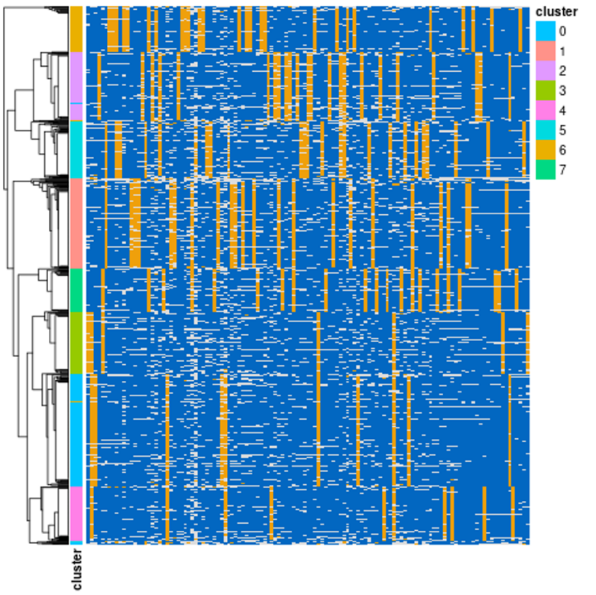
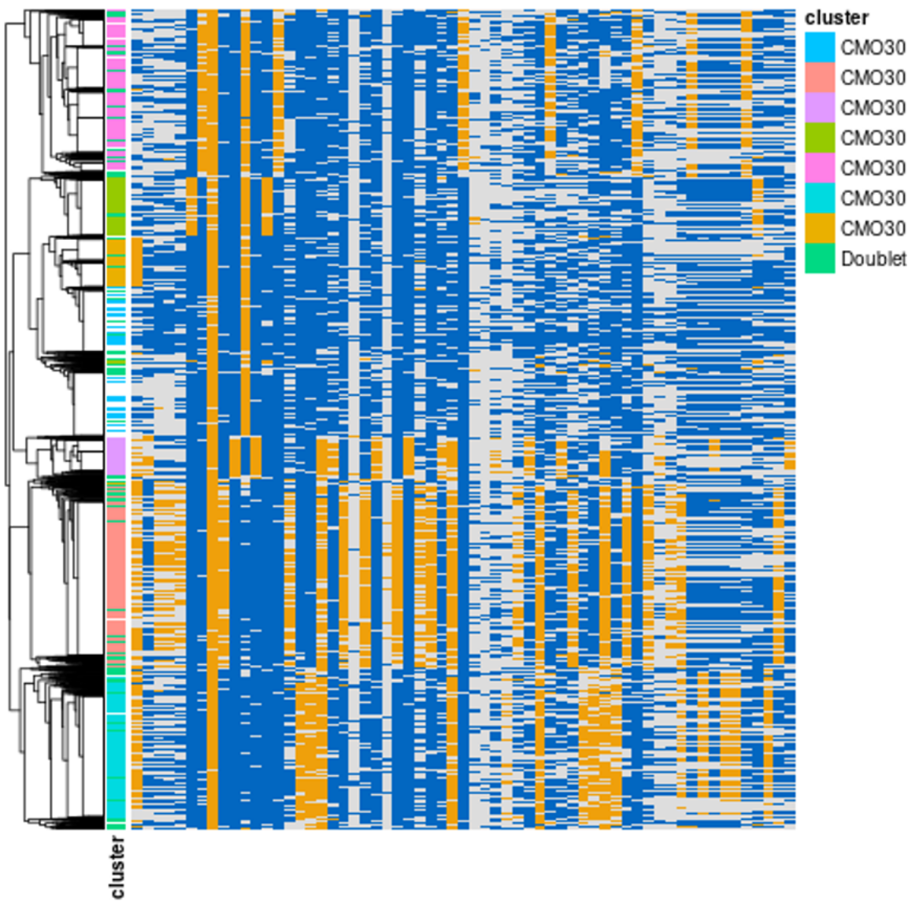
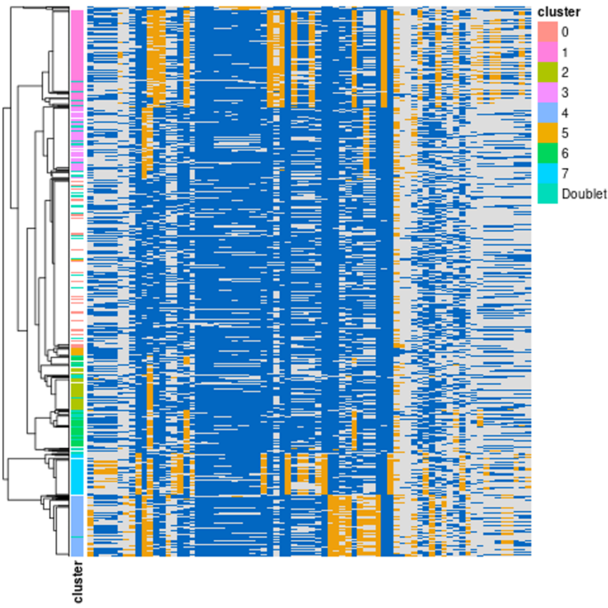

# demux_mt

## Overview
This program attempts to identify the individual of origin of each cell in a pool by inferring the mixture of mitochondrial haplotypes. It does not require any prior knowledge of variant sites or genotypes. Here are some potential use cases:

* Individuals were pooled together and sequenced with no prior knowledge of genotypes, and you want to quickly learn whether they all made it into the data set and whether they are fairly evenly represented
* Individuals that have already been sequenced were pooled together, and `demux_vcf` was used to infer the individual of origin of each cell. To ensure that this worked correctly, you want to have a second, independent identification of each cell to compare to.
* You would like to know something about the mitochondrial haplotypes present in the cells
* You want to obtain genomic variants for the individuals in your pool, without prior knowledge of genotypes of the individuals. You can use this program to get an idea of which cells come from which individuals. With this first round of cell-to-individual assignments, you can use the program `utils/bam_indiv_rg` to add read groups to the BAM that mark which individual a cell comes from, and then run a variant caller to find genomic SNPs that segregate among the individuals. If desired, you can then run `demux_vcf` using these variants, to get more confident assignments for more cells. 

## Pitfalls

* [NUMTs](https://en.wikipedia.org/wiki/Nuclear_mitochondrial_DNA_segment) are very common in some species and will attract reads away from the mitochondrial sequence, making it hard for this program to work. NUMTs are more of a problem in [non-human primates](https://www.ncbi.nlm.nih.gov/pmc/articles/PMC7671390/) than in humans. To deal with them, we recommend an approach similar to that described [here](https://github.com/caleblareau/mitoblacklist/): simulate mitochondrial reads, map to the reference genome with the mitochondrial sequence removed, run a peak caller like [MACS2](https://github.com/macs3-project/MACS) to find candidate NUMTs, and use the resulting BED file to mask the reference genome using a tool like [bedtools maskfasta](https://gensoft.pasteur.fr/docs/bedtools/2.29.2/content/tools/maskfasta.html). This must be done before aligning your single-cell sequencing data.
* To confidently identify the mitochondrial haplotype of a cell, there must be a large number of reads in that cell that align to the mitochondrial sequence. Unfortunately, high numbers of mitochondrial reads are also often a [red flag](https://scanpy.readthedocs.io/en/stable/tutorials/basics/clustering.html) during quality control in single cell sequencing analysis. This means that the cells most confidently assigned to an individual of origin using `demux_mt` are also often low-quality cells that will later be filtered out. Because of this, if you need to identify individuals of origin and do not have variant call data, we recommend using `demux_mt`, inserting read groups to mark these inferred individuals in the BAM file, running a variant caller to genotype these individuals at genomic variants, and then running `demux_vcf` to re-identify your cells using these genomic variants.

## Running the program

* Run `demux_mt` with the BAM file provided as `-b`, the output prefix as `-o`, and if the mitochondrial sequence has a name other than chrM, specify `-m seqname`, where `seqname` is the name of the mitochondrial sequence in the reference genome.
  * This will create the following output files:
    * `[output_prefix].vars` lists variable sites on the mitochondrial genome that compose the mitochondrial haplotypes
    * `[output_prefix].haps` lists the inferred mitochondrial haplotypes, one per line, where each character is 0 (for major allele) or 1 (for minor allele), and each corresponds to a variant site in the `.vars` file.
    * `[output_prefix].cellhaps` contains information used to plot mitochondrial haplotypes in individual cells. Each row represents a cell, the first column lists cell barcode, and all subsequent columns (tab separated) contain the most common allele at each variant site (or NA in the case of low coverage/missing data).
    * `[output_prefix].assignments` contains the likeliest individual of origin assigned to each cell. Columns are cell barcode, individual (given as a 0-based numeric ID), droplet type (S = singlet; D = doublet), and the ratio of the log likelihood of the best to second best choice.

### Identifying cells using mitochondrial haplotypes inferred on a prior run

In this case, you can use `demux_mt` again, but set `--vars/-v` to `[output_prefix].vars` from the prior run and `--haps/-H` to `[output_prefix].haps` from the prior run and be sure to choose a new `--output_prefix/-o` for the new run. If you would like to change the names of the individuals from numeric IDs, create a text file with individual names, one per line, in the same order as the haplotypes in the `.haps` file, and provide this file with the `--ids/-i` option.

## Plotting to check output

Successful clustering (ATAC)| Successful clustering (RNA, whole cell) | Unsuccessful clustering (RNA, multiome)|
:--------------------------:|:---------------------------------------:|:-------------------------:
  |   |  |

The program `/plot/demux_mt_clust.R` is a good way to visually inspect the results of a `demux_mt` run. It only requires the output prefix given to demux_mt as an argument, and will attempt to hierarchically cluster all cells with at least 50% of inferred variable sites covered. In addition to plotting each cell's mitochondrial variants and clustering cells by similarity, it will show the inferred individual from `demux_mt` next to the cluster heatmap. If the number of inferred individuals is clearly discernable in the heatmap, and the color bars showing inferred individuals line up well with these inferred clusters. this is good evidence that everything worked.

The program `/plot/demux_mt_unclust.R` is a way to visualize the results of `demux_mt` without hierarchical clustering. It will sort cells by their assigned individual, rather than cell-cell similarity and thus is more of a way to visualize the data than to validate results.

## Subclustering

Sometimes, if there are very uneven numbers of cells from different individuals, or if there are multiple deeply divergent groups of mitochondrial haplotypes (i.e. different species mapped to the same reference genome), `demux_mt` may infer a small number of clusters corresponding to these deeply divergent groups, rather than recovering all individuals. If you suspect this has happened, the program `mt_subcluster.py` can perform another round of clustering on one or more of these groups. This program takes as input the results of a `demux_mt` run, and the names of one or more clusters/inferred individuals to subcluster. It then re-runs `demux_mt` on cells from each cluster individually, looking for more groups, and then merges all of the results together into one set of output files, using the program `mt_merge_hierarchical.py`. The result is a set of output files with the new given output prefix, along with plots (above) to inspect.

## Finding genomic variants

If you want to use this tool to confidently identify the individual of origin of most of your cells but do not have genotyping data from the individuals that were pooled together, you can use `demux_mt` to get a foothold. 

After running `demux_mt` and validating the results, run the program `utils/bam_indiv_rg` with the same BAM file (as `-b`), the output `.assignments` file (as `-a`), and the name of a new BAM file to create (as `-o`). You may also filter the assignments by confidence using the `-l` parameter with a log likelihood ratio cutoff. The resulting BAM file will be a copy of the original, limited to cell barcocdes that appeared in the `.assignments` file and containing read group tags identifying each read as originating from one of the inferred individuals (a "sample" in the read group). After indexing the new BAM file with `[samtools](https://github.com/samtools/samtools) index`, you can run a variant caller such as [FreeBayes](https://github.com/freebayes/freebayes) or [GATK](https://gatk.broadinstitute.org/hc/en-us) on this file. 

You should clean up the resulting VCF to discard low-quality variants, indels, fixed alleles, and sites where genotypes are missing in most individuals. This can be accomplished with [bcftools](https://samtools.github.io/bcftools/).

If you are left with at least several hundred thousand variants (although fewer is still possible), you should now be able to run `demux_vcf` with your BAM file and these variants to more confidently identify a higher number of cells than using the mitochondrial identifications alone. 

[Back to main README](../README.md)
