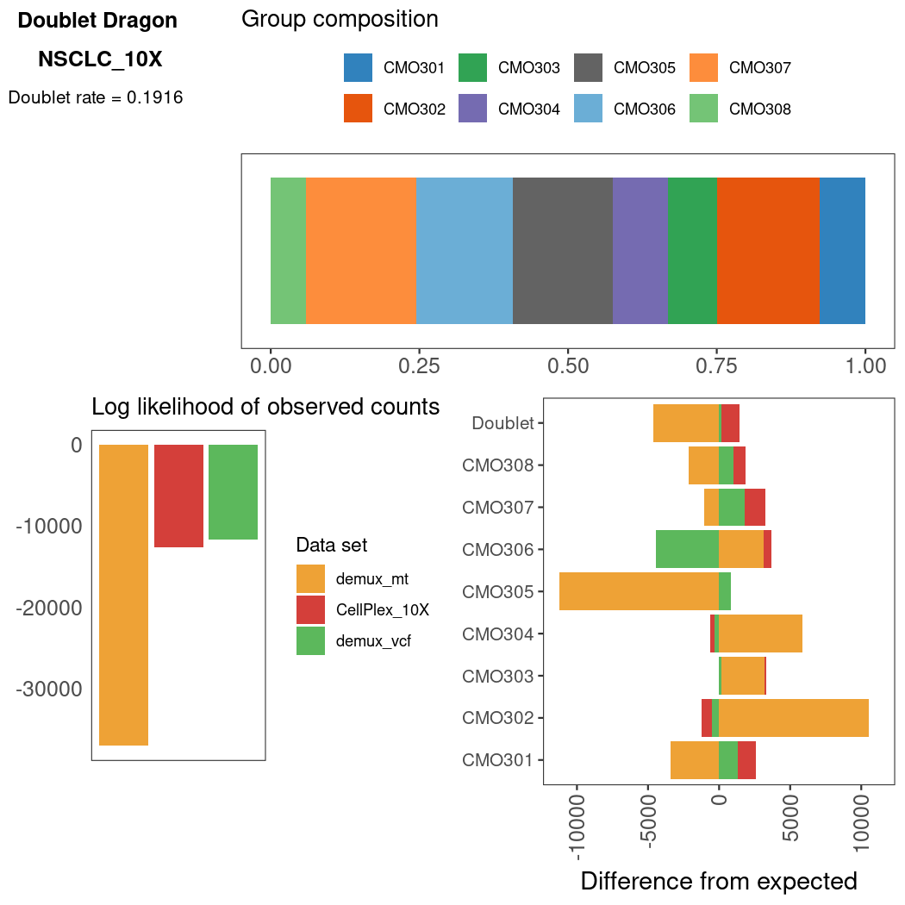
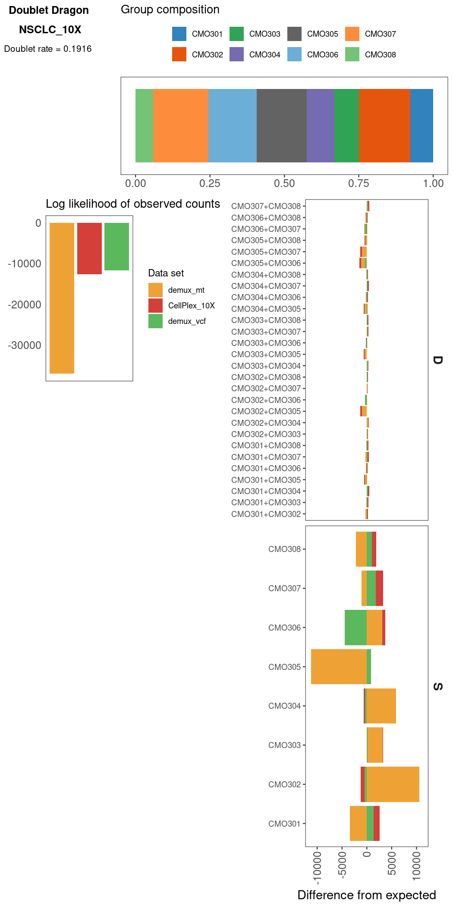

# doublet_dragon

<p>

</p>

All programs in `CellBouncer` that assign cells to individuals are also capable of classifying cells as doublets (or multiplets, in the case of `demux_tags`). Each set of identifications can end up with a different doublet rate, however, depending on how reliable each piece of information is, how many data were collected for each data type, and other factors. 

Additionally, each program infers only specific types of doublets. For example, using `demux_species` allows you to see inter-species doublets but not within-species doublets and `demux_vcf` allows you to see inter-individual doublets within the same species, but not same-individual doublets. For the sake of quality control, and to form an expectation when running a program like [scrublet](https://github.com/swolock/scrublet) to find inter-cell type doublets, it can be helpful to have an estimate of the global doublet rate in the data set. Users should typically have an expectation of this value beforehand, based on how many cells were loaded.

The program `doublet_dragon` is designed to synthesize information across data types and infer, for each type of classification, the probability of each type of singlet classification in the data set, as well as a global doublet rate. If any two data sets are intended to make the same assignments (i.e. if you have identified individuals using a VCF and `demux_vcf`, and you have also labeled the same individuals using MULTIseq and assigned labels using `demux_tags`), `doublet_dragon` is capable of treating the same individual assignments as the same information across data sets, as long as they are given the same names in the output `.assignments` files.

## Running the program
To run `doublet_dragon`, simply pass paths to one or more `.assignments` files after the name of the program:
```
doublet_dragon [output_prefix1].assignments ([output_prefix2].assignments [output_prefix3].assignments]...)
```

`doublet_dragon` will output a global doublet rate, as well as the probability of sampling each type of individual in the data set, to `stdout`.

## Plotting

Without D option enabled| With D option enabled |
:--------------------------:|:---------------------------------------:
  |   |


[Back to main README](../README.md)
